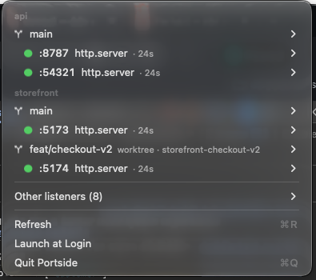

<p align="center">
  
</p>

<h1 align="center">Portside</h1>

<p align="center">
  <b>Every dev server on your Mac, grouped by repo and git worktree — in the menu bar.</b><br>
  See what's running on which port, which branch started it, and stop it in one click.
</p>

<p align="center">
  
</p>

---

## Why

`lsof -iTCP -sTCP:LISTEN` tells you *node* is on `:5174`. It doesn't tell you it's the
Vite server you started three days ago in a worktree you already merged.

If you work with several repos or git worktrees at once, ports pile up: `5173`, `5174`,
`5175`, `8080`, `8787`… Portside answers "what is this, and can I kill it?" without a
terminal.

## Features

- **Grouped by repo → checkout → server.** Linked git worktrees sit under their main
  repository, labelled with their branch.
- **Knows the tool, not just the binary.** `node` becomes `vite`, `next`, `wrangler`,
  `astro`, `storybook`… by reading the process's arguments.
- **Uptime per server** — spot the forgotten ones.
- **One-click actions:** open `localhost:<port>`, copy the URL, stop (SIGTERM) or force quit
  (SIGKILL), stop every server in a worktree at once.
- **Jump to the code:** open the checkout in your editor (Cursor, VS Code, Zed, Windsurf,
  Sublime, Xcode) or terminal (Ghostty, iTerm, Warp, kitty, WezTerm, Terminal) — whichever
  you have installed.
- **Everything else stays out of the way.** AirPlay, Spotify, Docker and other listeners
  that weren't started from a git checkout go under *Other listeners*.
- **Light:** no Dock icon, no permissions to grant, no network access, no dependencies.
  A scan takes ~50–100 ms.

## Install

Download `Portside.zip` from the [latest release](../../releases/latest), unzip, and move
`Portside.app` to `/Applications`.

The app is not notarized yet, so macOS blocks the first launch. Either right-click →
**Open**, or:

```sh
xattr -dr com.apple.quarantine /Applications/Portside.app
```

Requires macOS 14 Sonoma or later. Universal binary (Apple silicon + Intel).

### Build from source

Only the Xcode Command Line Tools are needed — no full Xcode.

```sh
git clone https://github.com/brentc22/portside.git
cd portside
make run        # builds, installs to /Applications and launches
```

## How it works

| Question | Answer | How |
| --- | --- | --- |
| What's listening? | pid + ports | one `lsof -nP -iTCP -sTCP:LISTEN -F pcn` call |
| Where was it started? | working directory | `proc_pidinfo(PROC_PIDVNODEPATHINFO)` — straight from the kernel |
| What is it? | `vite`, `next`, … | argv via `sysctl(KERN_PROCARGS2)`, matched against `node_modules/.bin/*` |
| Which repo and branch? | repo, worktree, branch | walks up to `.git`, follows `gitdir:` and `commondir` for worktrees, reads `HEAD` |

No `git` subprocesses, no per-process `ps` calls: one `lsof`, the rest are syscalls and a
few small file reads. Only your own processes are visible, so no admin rights are needed.

## Development

```sh
make test           # unit tests (swift run PortsideTests)
make bundle         # Portside.app in the repo root
scripts/demo.sh     # start fake repos + servers to play with; `scripts/demo.sh stop` cleans up
```

Tests are a plain executable with a tiny harness instead of XCTest, so they run with just
the Command Line Tools. Exit code 0 means green.

Launch arguments for screenshots and debugging:

- `--show-menu` opens the menu right after launch
- `--only-under <path>` only shows repos below that path

```sh
open Portside.app --args --show-menu --only-under ~/.portside-demo
```

### Layout

```
Sources/
  PortsideCore/     scanning, parsing, git resolution, grouping — no AppKit, fully tested
  Portside/         the menu bar app (AppKit)
  PortsideTests/    tests
```

## Roadmap

- [ ] Notification when a server has been running for longer than N days
- [ ] Custom links per repo (e.g. preview deployments per branch)
- [ ] Docker/OrbStack: map published ports back to their compose project
- [ ] Global hotkey
- [ ] Notarized builds and a Homebrew cask

Ideas and PRs welcome — open an issue first for anything big.

## License

[MIT](LICENSE)
